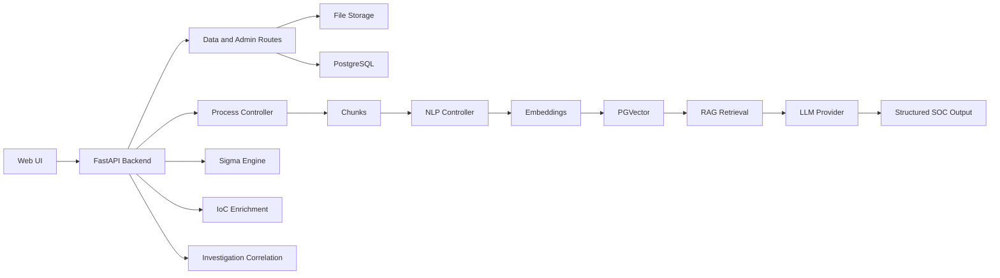
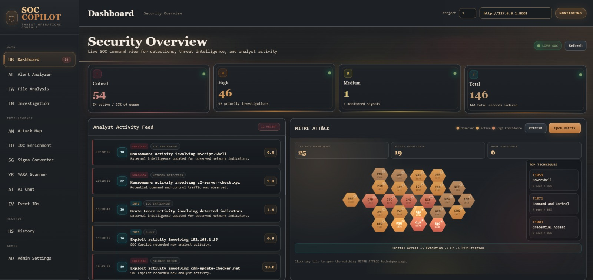
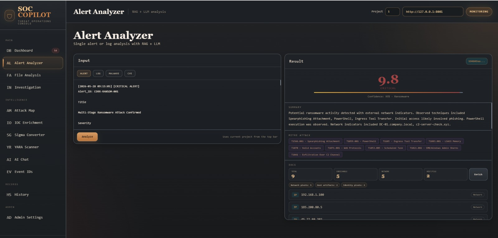
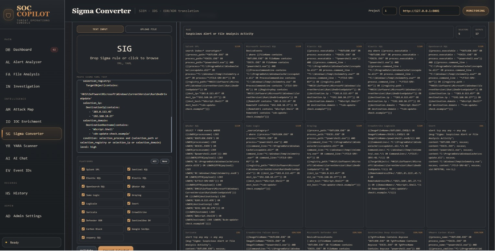
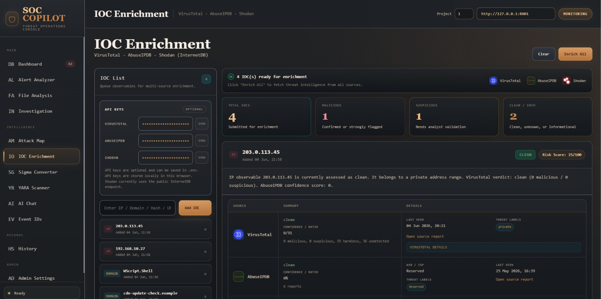
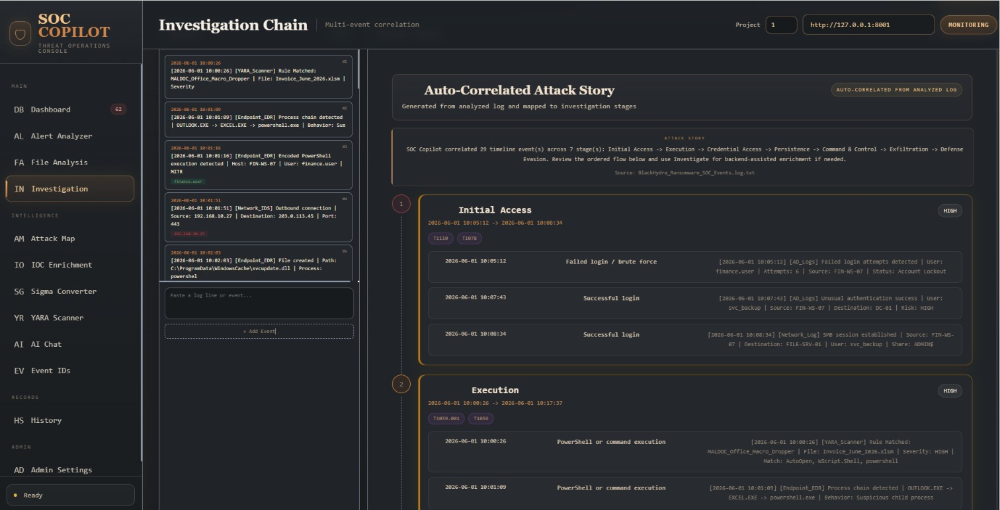
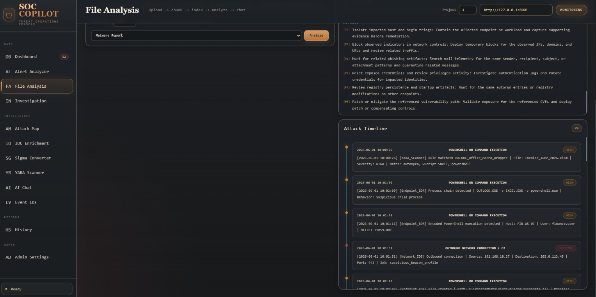

# SOC Copilot - AI-Powered Assistant for Security Operations Center Analysts

SOC Copilot is an academic SOC assistant prototype that helps analysts triage security alerts, analyze logs and files, extract indicators of compromise, enrich CVEs and IoCs, correlate multi-event attack chains, and convert Sigma detection rules into SIEM, EDR, XDR, and IDS query formats.

The project combines a FastAPI backend, a static web dashboard, PostgreSQL/PGVector storage, retrieval-augmented generation, and LLM provider integrations for local or API-backed analysis workflows.

## Project Status

Status: graduation-project prototype.

This repository is prepared for public GitHub review, portfolio use, instructor evaluation, and technical walkthroughs. It is not production-ready for a live SOC without authentication, authorization, deployment hardening, audit logging, and a formal security review.

## Main Problem

SOC analysts often work across many disconnected tools while handling high-volume alerts, log files, malware reports, threat intelligence, CVEs, and detection rules. This creates several practical problems:

- Alert triage is slow and repetitive.
- Evidence from uploaded files is hard to reuse across analysis and chat.
- IoCs, CVEs, MITRE techniques, timelines, and recommended actions are often extracted manually.
- Sigma rules need to be translated into the query language used by each SIEM, EDR, XDR, or IDS platform.
- Multi-event investigations require correlation across login failures, suspicious process execution, network activity, and possible lateral movement.

## Proposed Solution

SOC Copilot provides a single analyst-facing workflow:

```text
Upload or paste security evidence
-> Parse and chunk content
-> Store project context
-> Index embeddings in PGVector
-> Retrieve relevant context
-> Generate structured security analysis
-> Convert or export detections
```

The goal is to assist an analyst, not replace analyst judgment. The system produces summaries, severity estimates, IoCs, MITRE mappings, likely attack narratives, detection ideas, and recommended response actions that should be reviewed before operational use.

## Key Features

- Security alert and log analysis with structured threat output.
- File analysis for PDF, TXT, and LOG inputs.
- RAG-based project knowledge base over uploaded content.
- AI chat grounded in indexed project files.
- CVE analysis and enrichment from provided CVE context.
- IoC type detection and enrichment for IPs, domains, URLs, and hashes.
- Multi-event investigation chain generation.
- Sigma rule validation and conversion.
- Supported Sigma conversion targets include Splunk, Elastic KQL/EQL, OpenSearch DQL, Microsoft Sentinel KQL, QRadar AQL, Sumo Logic, Graylog, LogScale, CrowdStrike, Defender XDR, SentinelOne Deep Visibility, Carbon Black, Google SecOps, osquery SQL, Snort, and Suricata.
- YARA scanner workflow for static rule matching against uploaded files.
- Analysis history, feedback, and dashboard statistics.
- Reference lookup for Windows and Sysmon event IDs.
- Static web UI served by the FastAPI backend.

## System Architecture Overview



The backend entry point is `src/main.py`. It creates the FastAPI app, configures Prometheus metrics, initializes PostgreSQL, creates generation and embedding clients, connects the vector database provider, registers API routers, and mounts the static frontend from `web/`.

## RAG Pipeline

SOC Copilot uses retrieval-augmented generation to ground answers in project-specific material:

1. A user uploads a PDF, TXT, or LOG file.
2. `DataController` stores the uploaded asset under the project context.
3. `ProcessController` reads the file and splits text into chunks.
4. Chunks and metadata are persisted in PostgreSQL.
5. `NLPController` generates embeddings and indexes them with PGVector.
6. Search and chat requests retrieve the most relevant chunks for the selected project.
7. The selected context is passed to the configured LLM provider.
8. The system returns a grounded answer or structured security report.

This design allows the same uploaded evidence to be reused by file analysis, AI chat, semantic search, alert triage, investigation, and admin knowledge-base workflows.

## Main Modules

- `src/main.py` - FastAPI application setup, startup/shutdown hooks, router registration, static frontend mount.
- `src/routes/` - API routes for data upload, RAG, chat, analysis, investigation, IoC enrichment, Sigma conversion, admin KB operations, reference data, and YARA scanning.
- `src/controllers/` - Application orchestration for data handling, processing, NLP, SOC analysis, investigation, Sigma conversion, and projects.
- `src/modules/log_analysis/` - Log parsing helpers.
- `src/modules/investigation/` - Correlation logic for attack-chain style analysis.
- `src/modules/threat_intel/` - Indicator and threat-intelligence helper logic.
- `src/modules/sigma/` - Sigma parsing, validation, and multi-platform conversion engine.
- `src/modules/output/` - Output formatting helpers.
- `src/stores/llm/` - OpenAI, Ollama-compatible, and Cohere provider abstractions.
- `src/stores/vectordb/` - PGVector and Qdrant vector database provider abstractions.
- `web/` - Static HTML, CSS, and JavaScript SOC console.
- `docker/` - Docker Compose support for local PGVector.
- `docs/` - Screenshots and supporting project documentation.

## Tech Stack

- Backend: Python, FastAPI, Pydantic, SQLAlchemy async, Alembic.
- Frontend: HTML, CSS, JavaScript.
- Database: PostgreSQL with PGVector.
- Vector/RAG: PGVector provider, optional Qdrant provider abstraction, chunking, embeddings, semantic retrieval.
- LLM providers: OpenAI-compatible provider, Ollama-compatible local provider, Cohere integration.
- Security workflows: Sigma, YARA, MITRE ATT&CK mapping concepts, IoC enrichment, CVE analysis, Windows/Sysmon event references.
- Operations: Docker Compose for local PGVector, Prometheus metrics setup.
- Testing: focused Sigma converter tests under `src/tests/`.

## Screenshots

### Dashboard



### Alert Analyzer



### Sigma Converter



### IoC Enrichment



### Investigation Chain



### File Analysis



## Demo Scenarios

Detailed walkthroughs are available in [docs/demo-scenarios.md](docs/demo-scenarios.md).

### Brute Force Detection

Paste repeated failed login events followed by a successful login. SOC Copilot should identify a likely brute-force sequence, account-compromise risk, relevant MITRE techniques, and containment actions.

### Suspicious PowerShell Execution

Analyze a process-creation log containing encoded PowerShell, download commands, or suspicious network behavior. The expected output is a structured alert summary with process details, likely behavior, detection ideas, and response recommendations.

### CVE Enrichment

Submit a CVE ID and supporting text. The system should summarize affected technology, exploitation relevance, risk, mitigation priorities, and investigation notes.

### Sigma Rule Conversion

Paste or upload a Sigma rule. The converter validates the rule and generates query equivalents for supported platforms such as Splunk, Elastic KQL, Sentinel KQL, QRadar AQL, Defender XDR, CrowdStrike, Snort, and Suricata.

### IoC Enrichment

Submit IP addresses, domains, URLs, or hashes. SOC Copilot detects indicator types and can enrich them with optional provider keys where available.

### Investigation Chain

Provide multiple related events such as authentication failures, successful access, suspicious process execution, outbound connection, and log clearing. The system builds a timeline, likely attack story, pivot points, IoCs, and recommended next steps.

## Installation and Setup

See the longer setup guide in [docs/setup.md](docs/setup.md).

### Prerequisites

- Python 3.11 or newer.
- PostgreSQL with PGVector, or Docker Desktop / Docker Engine for the provided PGVector service.
- An LLM backend:
  - local Ollama-compatible endpoint, or
  - OpenAI-compatible API credentials.
- Cohere API key if using Cohere embeddings.

### Clone and Create an Environment

```bash
git clone <your-repository-url>
cd soc-copilot-rag-llm
python -m venv .venv
```

Windows:

```powershell
.\.venv\Scripts\Activate.ps1
```

macOS/Linux:

```bash
source .venv/bin/activate
```

Install dependencies:

```bash
pip install -r src/requirements.txt
```

### Environment Variables

Copy the example file and fill in local values:

```bash
cp src/.env.example src/.env
```

Do not commit `src/.env`, `docker/.env`, or any file under `docker/env/` that does not start with `.env.example`.

Important variables:

| Variable | Purpose |
| --- | --- |
| `POSTGRES_USERNAME` | PostgreSQL username. |
| `POSTGRES_PASSWORD` | Local PostgreSQL password. Use your own value. |
| `POSTGRES_HOST` | Database host, for example `localhost` or `pgvector`. |
| `POSTGRES_PORT` | Database port. |
| `POSTGRES_MAIN_DATABASE` | Application database name. |
| `GENERATION_BACKEND` | LLM generation backend, for example `OLLAMA` or `OPENAI`. |
| `EMBEDDING_BACKEND` | Embedding backend, for example `COHERE` or `OPENAI`. |
| `OPENAI_API_KEY` | OpenAI-compatible API key when required. |
| `OPENAI_API_URL` | OpenAI-compatible base URL. For local Ollama-compatible use, this may point to localhost. |
| `COHERE_API_KEY` | Cohere API key when using Cohere embeddings. |
| `OLLAMA_API_URL` | Optional local Ollama-compatible endpoint. |
| `GENERATION_MODEL_ID` | Generation model name. |
| `EMBEDDING_MODEL_ID` | Embedding model name. |
| `EMBEDDING_MODEL_SIZE` | Embedding vector size. Must match the embedding model. |
| `VECTOR_DB_BACKEND` | Vector backend, commonly `PGVECTOR`. |
| `RAG_TOP_K` | Number of retrieved chunks for RAG. |
| `VIRUSTOTAL_API_KEY` | Optional IoC enrichment key. |
| `ABUSEIPDB_API_KEY` | Optional IoC enrichment key. |

### Database Setup

The repository includes Alembic migrations. Before running migrations, replace placeholders in `src/alembic.ini` with local database values or adapt the Alembic configuration to read from your environment.

```bash
cd src
alembic upgrade head
```

### Run the Backend

From the `src/` directory:

```bash
uvicorn main:app --host 127.0.0.1 --port 8001 --reload
```

Backend health/info endpoint:

```text
http://127.0.0.1:8001/api/v1/
```

Interactive API docs:

```text
http://127.0.0.1:8001/docs
```

### Run the Frontend

The frontend is mounted by FastAPI:

```text
http://127.0.0.1:8001/web/
```

Open the frontend through the backend so API calls use the same local service.

### Optional Docker Setup

`docker/docker-compose.yml` currently provides a local PGVector service.

```bash
cd docker
cp .env.example .env
# edit docker/.env and set POSTGRES_PASSWORD
docker compose up -d pgvector
```

Then set `src/.env` to match the Docker database values, usually:

```dotenv
POSTGRES_HOST="localhost"
POSTGRES_PORT=5432
POSTGRES_MAIN_DATABASE="soc_copilot"
```

## API Overview

Detected FastAPI route groups:

| Area | Endpoints |
| --- | --- |
| Base | `GET /api/v1/` |
| Data upload and processing | `POST /api/v1/data/upload/{project_id}`, `POST /api/v1/data/process/{project_id}` |
| RAG indexing/search/answering | `POST /api/v1/nlp/index/push/{project_id}`, `GET /api/v1/nlp/index/info/{project_id}`, `POST /api/v1/nlp/index/search/{project_id}`, `POST /api/v1/nlp/index/answer/{project_id}` |
| Chat | `POST /api/v1/chat/{project_id}` |
| SOC analysis | `POST /api/v1/analysis/alert/{project_id}`, `POST /api/v1/analysis/file/{project_id}`, `POST /api/v1/analysis/asset/{project_id}`, `POST /api/v1/analysis/cve/{project_id}` |
| Analysis history | `GET /api/v1/analysis/history`, `GET /api/v1/analysis/history/{analysis_uuid}`, `PATCH /api/v1/analysis/history/{analysis_uuid}/feedback`, `GET /api/v1/analysis/stats` |
| Investigation | `POST /api/v1/investigation/analyze`, `POST /api/v1/investigation/file` |
| IoC enrichment | `POST /api/v1/ioc/enrich`, `POST /api/v1/ioc/detect-type` |
| Sigma conversion | `POST /api/v1/sigma/convert`, `POST /api/v1/sigma/validate`, `POST /api/v1/sigma/bulk-convert` |
| Sigma compatibility | `POST /sigma/convert`, `POST /sigma/validate`, `POST /sigma/bulk-convert` |
| Admin knowledge base | `POST /api/v1/admin/upload/{project_id}`, `POST /api/v1/admin/fetch-url/{project_id}`, `GET /api/v1/admin/kb-status/{project_id}`, `POST /api/v1/admin/clear/{project_id}` |
| Reference data | `GET /api/v1/reference/event-ids`, `GET /api/v1/reference/event-ids/{event_id}`, `GET /api/v1/reference/log-types` |
| SOC shortcut routes | `POST /analyze/logs`, `POST /analyze/cve`, `POST /investigate` |
| YARA scanner | `GET /api/v1/yara/sample/{project_id}`, `POST /api/v1/yara/scan/{project_id}` |

## Repository Structure

```text
soc-copilot-rag-llm/
|-- .env.example
|-- .gitignore
|-- README.md
|-- LICENSE
|-- docker/
|   |-- docker-compose.yml
|   |-- .env.example
|   `-- env/
|-- docs/
|   |-- setup.md
|   |-- architecture.md
|   |-- demo-scenarios.md
|   `-- assets/screenshots/
|-- scripts/
|   |-- start_all.sh
|   |-- start_api.sh
|   |-- status_api.sh
|   |-- stop_all.sh
|   `-- stop_api.sh
|-- src/
|   |-- main.py
|   |-- requirements.txt
|   |-- routes/
|   |-- controllers/
|   |-- models/
|   |-- modules/
|   |-- stores/
|   |-- utils/
|   `-- tests/
`-- web/
    |-- index.html
    |-- styles.css
    `-- app.js
```

Local-only folders such as `.run/`, `.venv/`, `src/.venv/`, generated uploads, Docker database files, and real `.env` files should not be committed.

## Evaluation Summary

The repository contains a working prototype structure with screenshots, focused Sigma converter tests, API route coverage for the main SOC workflows, and a frontend that exercises the core analyst flows.

Recommended evaluation dimensions for the graduation report:

- JSON validity and consistency of generated threat reports.
- Accuracy of IoC extraction and type detection.
- Quality of MITRE ATT&CK technique mapping.
- RAG answer grounding against uploaded project files.
- Sigma conversion correctness across target platforms.
- Investigation-chain quality on multi-event scenarios.
- Response latency with local and remote model backends.
- Analyst usability based on demo workflow completion.

## Limitations

- The project is an academic prototype, not a hardened SOC product.
- No production authentication or role-based access control is implemented in the current public-ready repository.
- LLM output quality depends on model choice, prompt behavior, and available context.
- External IoC enrichment depends on provider availability and valid API keys.
- The Sigma converter covers practical patterns but should be reviewed before operational deployment.
- The current Docker Compose file is focused on PGVector, not a full production stack.
- Uploaded real incident data should not be committed or shared publicly.

## Future Work

- Add authentication, authorization, and analyst roles.
- Add persistent task queues for long-running enrichment and file analysis.
- Add full SIEM ingestion connectors.
- Add formal benchmark datasets for alert and investigation evaluation.
- Improve explainability for MITRE and severity scoring.
- Add CI tests for API routes and RAG workflows.
- Add export formats for PDF, STIX/TAXII, and case-management systems.
- Package a complete Docker deployment with backend, frontend, database, and monitoring services.

## Team Members

- Mohmmad Khier AL-Mrayat
- Hussien Bader Jaber
- Osaid Ziad Khader Al-Hawamdeh
- Khaled Mohammed Bunyan
- Ahmad Raed Al-Hajjaj

## Academic Context

Project title: SOC Copilot - AI-Powered Assistant for Security Operations Center Analysts.

Project type: Undergraduate Graduation Project.

Program: Artificial Intelligence & Data Science.

Faculty: Faculty of Information and Communication Technology.

University: Tafila Technical University.

Academic year: 2026.

Supervisor: Dr. Iman Al-Qutaimat.

Committee member: Dr. Khaled Al-Rafou'.

Defense details: June 1, 2026, 12:00 PM - 12:30 PM, Room DS-ICT2.

Project grade: 92%.

This project was developed as an academic prototype demonstrating applied AI, retrieval-augmented generation, cybersecurity analytics, threat-intelligence enrichment, and security automation for SOC workflows.

## License

This repository includes an Apache License 2.0 file. Review and confirm the license choice with the project team and academic supervisor before public release.
