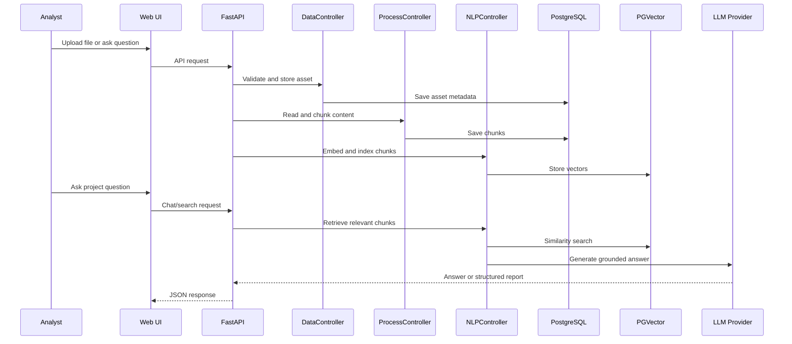

# Architecture

SOC Copilot is organized around a FastAPI backend, a static web frontend, PostgreSQL/PGVector storage, and provider abstractions for LLM generation, embeddings, and vector search.

## High-Level Flow

```text
Web UI
-> FastAPI route
-> Controller
-> Storage / parser / enrichment / converter
-> LLM or vector provider when needed
-> Structured JSON response
-> Web UI rendering
```

## Main Runtime Components

### Web Frontend

Location: `web/`

The frontend is a static HTML/CSS/JavaScript analyst console. It calls backend API endpoints for dashboard stats, alert analysis, file analysis, investigation chains, IoC enrichment, Sigma conversion, YARA scanning, chat, and reference lookups.

### FastAPI Application

Location: `src/main.py`

Responsibilities:

- Create the FastAPI application.
- Load settings through `helpers.config`.
- Initialize PostgreSQL async access.
- Initialize generation and embedding clients.
- Initialize the vector database provider.
- Register route groups from `src/routes/`.
- Mount the static frontend at `/web`.
- Expose metrics instrumentation.

### Controllers

Location: `src/controllers/`

Controllers coordinate application behavior and keep route handlers focused on request/response concerns. Important controllers include:

- `DataController` for file validation and asset storage.
- `ProcessController` for file reading and chunking.
- `NLPController` for indexing, semantic search, and RAG answers.
- `SOCAnalysisController` for alert, file, asset, and CVE analysis.
- `InvestigationController` for multi-event attack-chain analysis.
- `SigmaController` for Sigma validation and conversion.

### Modules

Location: `src/modules/`

Modules contain reusable domain logic:

- `log_analysis` parses log-like input.
- `investigation` correlates events into a timeline and likely attack path.
- `threat_intel` extracts and analyzes indicator context.
- `sigma` parses Sigma YAML and converts detection logic to target platforms.
- `output` formats structured responses.

### Models and Database Schemas

Location: `src/models/`

The project uses SQLAlchemy models and Alembic migrations for project assets, chunks, and threat-analysis records.

### Provider Abstractions

Locations:

- `src/stores/llm/`
- `src/stores/vectordb/`

The backend selects LLM and vector implementations from settings. This makes it possible to run local model workflows or API-backed workflows without changing route code.

## RAG Data Path



## API Route Groups

- `/api/v1/data` - upload and process files.
- `/api/v1/nlp` - index, search, and answer from project content.
- `/api/v1/chat` - project-grounded chat.
- `/api/v1/analysis` - alert, file, asset, CVE, history, stats, and feedback.
- `/api/v1/investigation` - event-chain analysis.
- `/api/v1/ioc` - indicator detection and enrichment.
- `/api/v1/sigma` and `/sigma` - Sigma validation and conversion.
- `/api/v1/admin` - knowledge-base upload, URL fetch, status, and clear operations.
- `/api/v1/reference` - Windows/Sysmon reference data.
- `/api/v1/yara` - YARA sample generation and scanning.
- `/analyze/logs`, `/analyze/cve`, `/investigate` - SOC shortcut routes.

## Security Notes

The repository is configured to ignore local secrets, virtual environments, generated uploads, runtime logs, and Docker database state. Public examples use placeholders only. Production use would require authentication, authorization, transport security, input limits, audit logging, and secret management.
